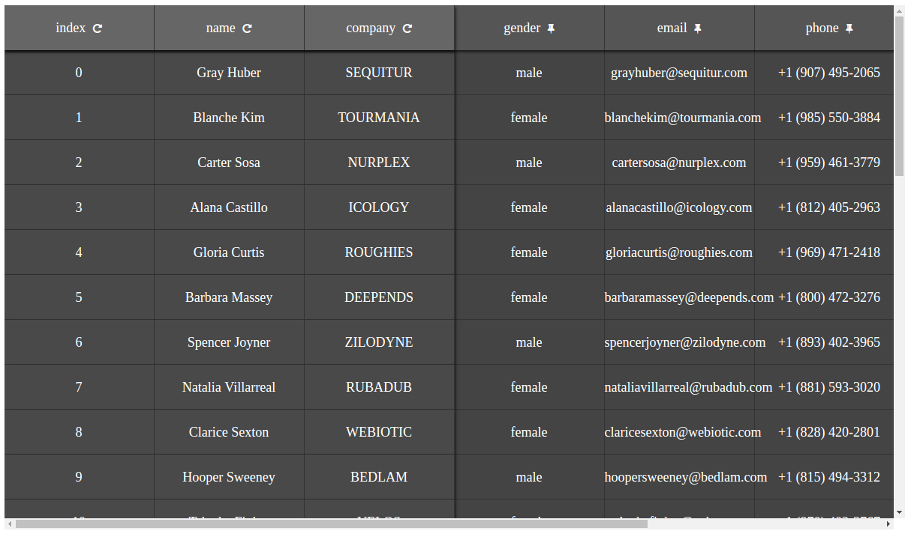

# ReportUI

## Overview
Angular module for representation long and high width data tables with fixed headers and columns and scrollable body.


## How to use
* Import module
* in your component.html add: `<app-table-layout [data]="data"></app-table-layout>`
* in your component.ts you must provide data in format: 
```javascript
data = {
    fixedColumnNames:["index", "name"],
    scrollableColumnNames:["gender", "company", "email", "phone", "address"],
    rows:[//your data objects with samr props...]
}
```

##Customizations
You can customize some css styles:
`<app-table-layout [data]="data" [rowHeight]="'50px'" [background]="'#3F51B5'" [color]="'#eee'"></app-table-layout>`


## Development server

Run `ng serve` for a dev server. Navigate to `http://localhost:4200/`. The app will automatically reload if you change any of the source files.

## Code scaffolding

Run `ng generate component component-name` to generate a new component. You can also use `ng generate directive|pipe|service|class|guard|interface|enum|module`.

## Build

Run `ng build` to build the project. The build artifacts will be stored in the `dist/` directory. Use the `-prod` flag for a production build.

## Running unit tests

Run `ng test` to execute the unit tests via [Karma](https://karma-runner.github.io).

## Running end-to-end tests

Run `ng e2e` to execute the end-to-end tests via [Protractor](http://www.protractortest.org/).
Before running the tests make sure you are serving the app via `ng serve`.

## Further help

To get more help on the Angular CLI use `ng help` or go check out the [Angular CLI README](https://github.com/angular/angular-cli/blob/master/README.md).
# ReportUI
